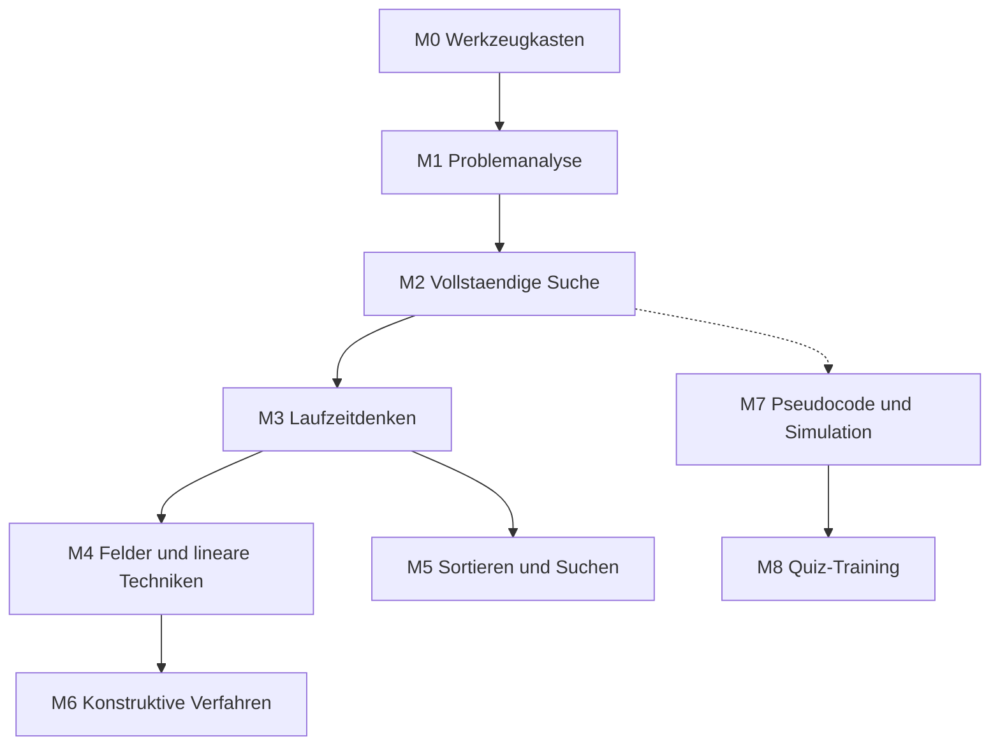

# Lernpfad

Der Kurs hat zwei Stränge, die parallel laufen.

**Strang A — Programmieren** bereitet auf die Vorrunde vor.
**Strang B — Denken ohne Code** bereitet auf die Erste Runde vor. Er braucht
keine Programmierkenntnisse und läuft ab Modul 2 nebenher.

## Abhängigkeiten

Gepunktet heisst: nicht zwingend, aber sinnvoll.

## Aufgaben über die Module hinweg

Der Graph oben zeigt, welches Modul auf welchem aufbaut. Die andere Achse ist
genauso wichtig: **dieselbe Aufgabe läuft über mehrere Module.**

Das ist Absicht. Eine SOI-Aufgabe besteht aus Teilaufgaben mit wachsenden
Schranken, und dieser Aufbau ist der rote Faden des Kurses. Du löst `endurance`
in M2 mit roher Gewalt, in M3 wird sie schnell, in M4 kommt eine neue Regel dazu
— und am Ende hast du alle 100 Punkte, mit einer Lösung, die du selbst
entwickelt hast.

| Aufgabe | Runde | Teilaufgaben | Punkte | Module |
|---|---|---|---|---|
| `cheeseparty` | Vorrunde | 1–2 | 100 | M1 |
| `directions` | Vorrunde | 1–3 | 100 | M1 |
| `sushi` | 2018 | 1 und 3 | 20 von 100 | M1 · Rest in M5 |
| `endurance` | Vorrunde | 1–5 | 100 | M2 · M3 · M4 |
| `stairracing` | 2021 | 1–4 | 100 | M0 · M2 · M3 · M4 |

Wer M0 bis M4 durchgearbeitet hat, hat **420 Punkte** eingereicht.

Deshalb lohnt es sich, die Aufgabenordner zu behalten: In M3 und M4 baust du auf
dem Programm auf, das du in M2 geschrieben hast.

## Übersicht

| Modul | Lektionen | Strang |
|---|---|---|
| M0 Werkzeugkasten | 2 | A |
| M1 Problemanalyse und Modellierung | 2 | A |
| M2 Vollständige Suche | 2 | A |
| M3 Laufzeitdenken | 3 | A |
| M4 Felder und lineare Techniken | 3 | A |
| M5 Sortieren und Suchen | 3 | A |
| M6 Konstruktive Verfahren | 2 | A |
| M7 Pseudocode und Simulation | 3 | B |
| M8 Quiz-Training | 2 | B |
