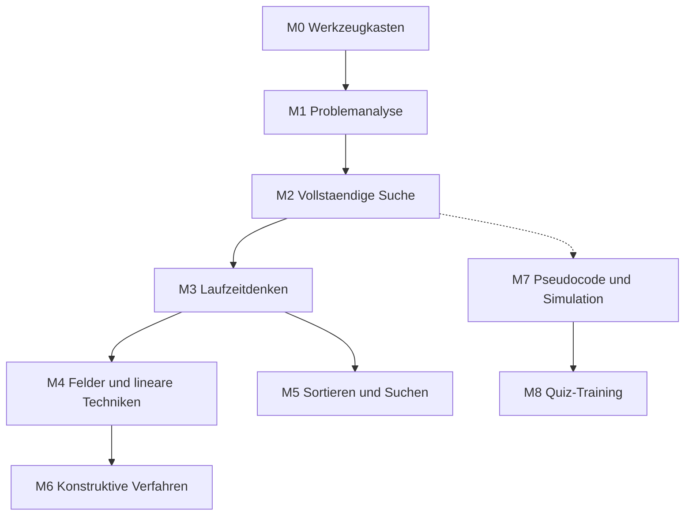

# Lernpfad

Der Kurs hat zwei Stränge, die parallel laufen.

**Strang A — Programmieren** bereitet auf die Vorrunde vor.
**Strang B — Denken ohne Code** bereitet auf die Erste Runde vor. Er braucht
keine Programmierkenntnisse und läuft ab Modul 2 nebenher.

## Abhängigkeiten

Gepunktet heisst: nicht zwingend, aber sinnvoll.

## Übersicht

| Modul | Lektionen | Strang |
|---|---|---|
| M0 Werkzeugkasten | 2 | A |
| M1 Problemanalyse und Modellierung | 2 | A |
| M2 Vollständige Suche | 2 | A |
| M3 Laufzeitdenken | 3 | A |
| M4 Felder und lineare Techniken | 3 | A |
| M5 Sortieren und Suchen | 3 | A |
| M6 Konstruktive Verfahren | 2 | A |
| M7 Pseudocode und Simulation | 3 | B |
| M8 Quiz-Training | 2 | B |
